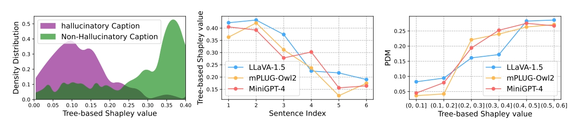
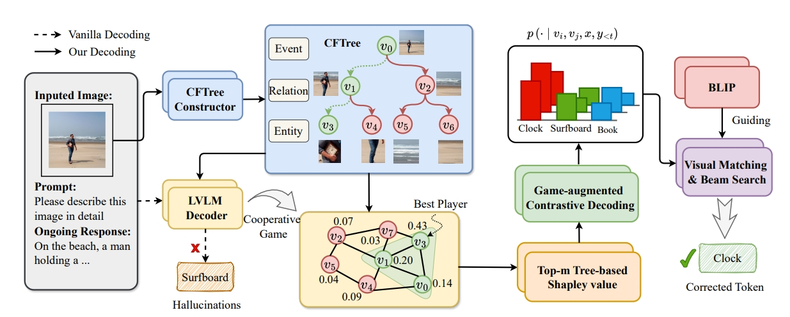

# [EMNLP 2024] Game on Tree: Visual Hallucination Mitigation via Coarse-to-Fine View Tree and Game Theory

## Overview
The implementation of **Game on Tree: Visual Hallucination Mitigation via Coarse-to-Fine View Tree and Game Theory**.

> GTHM is a training-free, plug-and-play decoding strategy to mitigate VH in LVLMs. Our method was inspired by practical observations that ambiguity in multi-granularity view perception exacerbates VH.  Based on these, we construct the CFTree to organize multi-granularity views. We innovatively model the retrieving optimal multi-granularity views as a cooperative game. Subsequently, we perform adaptive contrastive decoding based on game scores to achieve bias-free distribution. Comprehensive experiments demonstrate the effectiveness of our GTHM in reducing VH across different benchmarks and LVLM families.

  

  

##  Log

[2024.09.30] The project repository is created.

[2024.09.20] Our paper is accepted by EMNLP 2024!

---

The code will be released when it's tidied up. Stay tuned.

